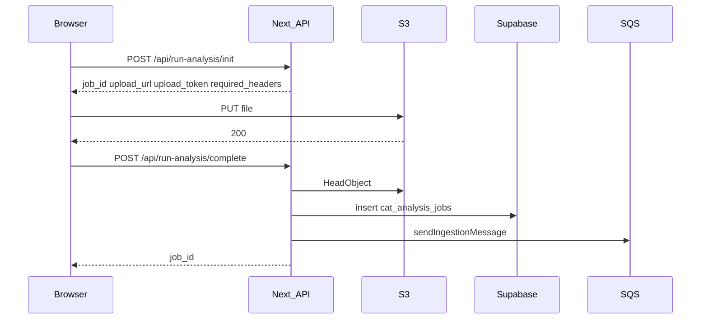

# CAT UI

Web UI for CAT (Content Analysis Toolkit): upload media, queue analysis jobs, and review cases.

## Recent update: direct S3 uploads (run-analysis)

File uploads no longer pass through the Next.js API. The browser uploads directly to S3 using a presigned PUT URL, then the API confirms the object and enqueues work.

### What changed

| Before | After |
|--------|--------|
| `POST /api/run-analysis` with `multipart/form-data` | Removed |
| Server buffered full file in memory, then `PutObject` | Browser `PUT` to S3 |
| Job row + SQS sent in one request | Job row + SQS only after upload is verified |
| ~10 MB practical limit on many hosts | Up to **100 MB** (client + server validation) |

URL and CSV ingest are unchanged (`/api/analysis/jobs`, batch endpoint).

### Upload flow



1. **Init** — Authenticated JSON request; server validates metadata, mints `job_id`, builds S3 key, returns presigned PUT URL and headers. No database row yet.
2. **PUT** — Client uploads the file to S3 with the exact `required_headers` from init.
3. **Complete** — Server verifies `upload_token`, confirms the object via `HeadObject`, inserts the job, sends SQS.

The run-analysis page polls job status the same way as before after `complete` returns `job_id`.

### API reference

#### `POST /api/run-analysis/init`

Auth required (session cookie or password header).

**Request body:**

```json
{
  "file_name": "clip.mp4",
  "content_type": "video/mp4",
  "byte_size": 52428800,
  "last_modified_ms": 1710000000000,
  "relative_path": ""
}
```

- `content_type` must be `image/*` or `video/*`.
- `byte_size` must be a positive integer ≤ 100 MB.
- `relative_path` is optional.

**Response:**

```json
{
  "job_id": "uuid",
  "upload_url": "https://...",
  "upload_token": "...",
  "expires_in": 900,
  "required_headers": {
    "Content-Type": "video/mp4"
  }
}
```

Only `Content-Type` is signed for the browser PUT (avoids SigV4 header mismatches). S3 user metadata and `Content-Disposition` are applied server-side on `complete` via `CopyObject`.

Presigned URLs expire in **15 minutes** (`900` seconds).

#### `POST /api/run-analysis/complete`

Auth required.

**Request body:**

```json
{
  "job_id": "uuid",
  "upload_token": "..."
}
```

**Response:** `{ "ok": true, "job_id": "uuid" }`

- Verifies object size and content type match init.
- Inserts `cat_analysis_jobs` only after S3 confirms the upload.
- Idempotent: repeating `complete` for an existing job returns success without duplicate inserts.

### S3 object layout

Objects are stored at:

```text
{CAT_S3_KEY_PREFIX}/{job_id}/{sanitized_stem}{ext}
```

Default prefix: `uploads` (override with `CAT_S3_KEY_PREFIX`).

User metadata on the object matches the previous proxy upload (`original-name-b64`, `client-last-modified-ms`, etc.) for worker compatibility.

### Environment variables

| Variable | Purpose |
|----------|---------|
| `AWS_REGION`, `AWS_BUCKET`, `AWS_ACCESS_KEY_ID`, `AWS_SECRET_ACCESS_KEY` | S3 presign, HeadObject, case media GET URLs |
| `CAT_S3_KEY_PREFIX` | Upload key prefix (default `uploads`) |
| `SESSION_SECRET` | Session cookies and `upload_token` HMAC (min 16 chars) |
| `UPLOAD_SIGNING_SECRET` | Optional; overrides `SESSION_SECRET` for upload tokens only |
| `SUPABASE_URL`, `SUPABASE_SERVICE_KEY` | Job records |
| `SQS_QUEUE_URL` | Ingestion queue (sent on `complete` only) |
| `APP_PASSWORD` | Demo auth |

### Infrastructure setup (required)

#### S3 bucket CORS

The browser must be allowed to `PUT` to the bucket from your app origin. Without CORS, **init succeeds but the PUT fails**.

Example rule (adjust origins):

```xml
<CORSRule>
  <AllowedOrigin>https://your-production-domain.example</AllowedOrigin>
  <AllowedOrigin>http://localhost:3000</AllowedOrigin>
  <AllowedMethod>PUT</AllowedMethod>
  <AllowedMethod>HEAD</AllowedMethod>
  <AllowedHeader>*</AllowedHeader>
  <ExposeHeader>ETag</ExposeHeader>
</CORSRule>
```

Apply via AWS Console → S3 → bucket → Permissions → CORS, or your IaC.

#### IAM

Credentials used by the app need at least:

- `s3:PutObject` (presigned PUT generation)
- `s3:HeadObject` (complete verification)
- `s3:GetObject` and `s3:PutObject` on object key (server-side `CopyObject` to apply metadata after upload)
- `s3:GetObject` (case media presigned GET URLs)

Scoped to the bucket and upload prefix is recommended.

#### Optional cleanup

If a user uploads to S3 but never calls `complete`, an object may exist without a DB row. Consider an S3 lifecycle rule to expire orphaned keys under `{prefix}/` after a retention period.

### Security notes

- AWS credentials never go to the browser; only short-lived presigned URLs.
- `Content-Length` is fixed at presign time — S3 rejects mismatched sizes.
- `upload_token` binds `job_id`, `s3_key`, size, and type; expires with the presign window.
- Keys are constrained to `{prefix}/{job_id}/...` — no arbitrary bucket paths.

### Relevant code

| Path | Role |
|------|------|
| `app/api/run-analysis/init/route.js` | Presign + token |
| `app/api/run-analysis/complete/route.js` | Verify + DB + SQS |
| `app/(dashboard)/run-analysis/page.js` | Client init → PUT → complete |
| `lib/runAnalysisUpload.js` | Validation, keys, metadata, tokens |
| `lib/s3.js` | `getPresignedPutUrl`, `headObjectFromS3`, `getPresignedGetUrl` |

### Manual test checklist

1. Configure bucket CORS for your dev origin.
2. Upload a small image: init → PUT → complete → case progresses in UI.
3. Upload a large file (e.g. 50 MB video) — should not hit Next.js body limits.
4. Call `complete` without PUT — expect 400 (object not found).
5. Call `complete` twice after success — second call is idempotent.
6. URL ingest still works via `/api/analysis/jobs`.

### Local development

```bash
npm install
npm run dev
```

Set environment variables (see `.env.prod` for a template list; use a local `.env` and never commit secrets).

```bash
npm run build
npm start
```
